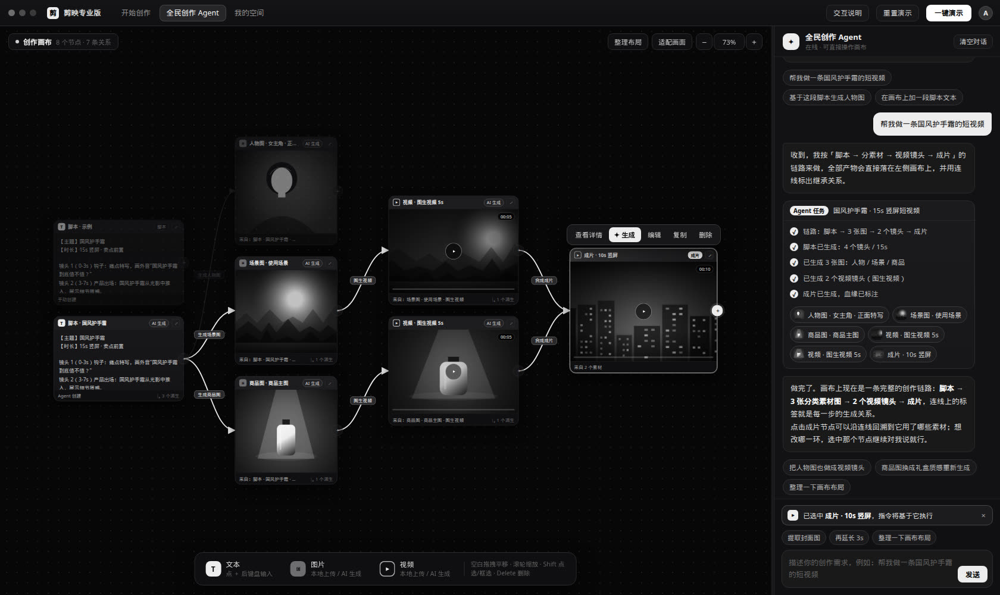
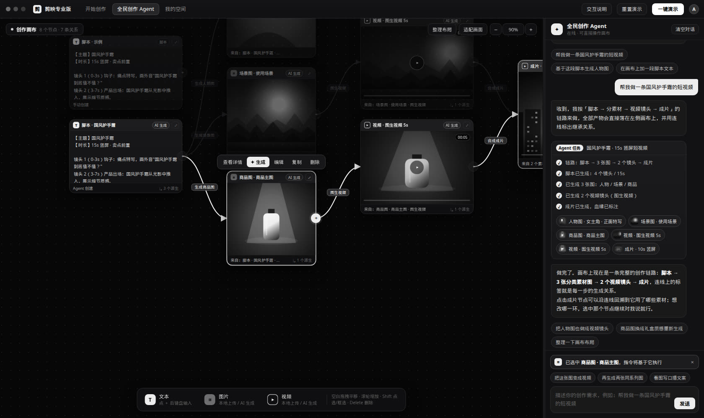
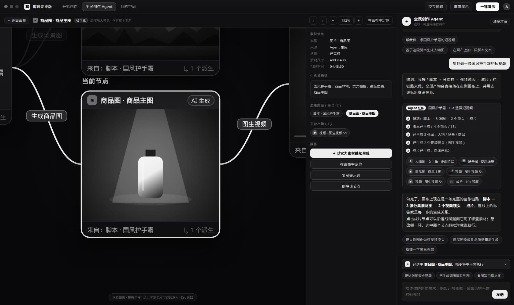
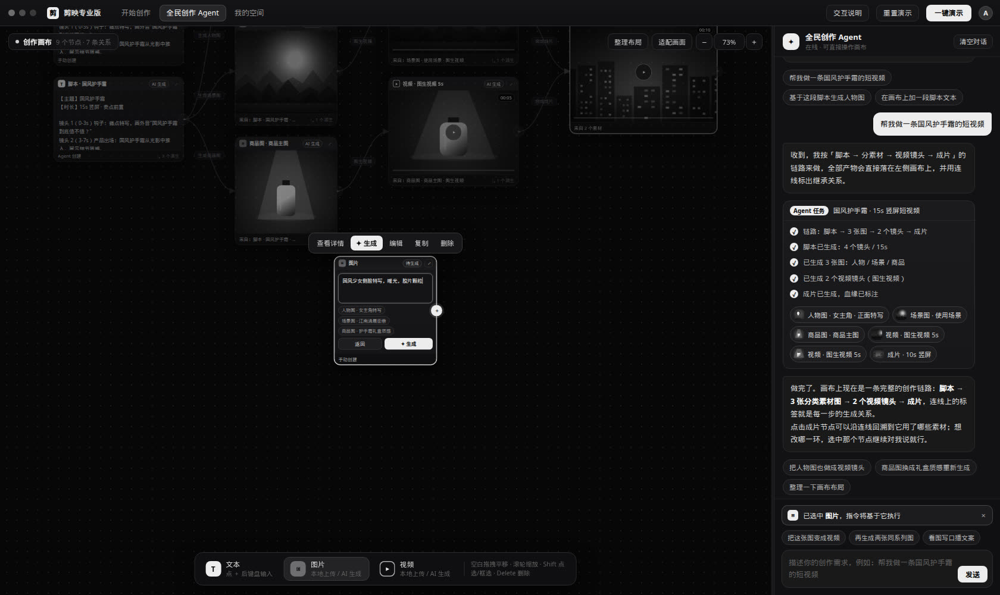
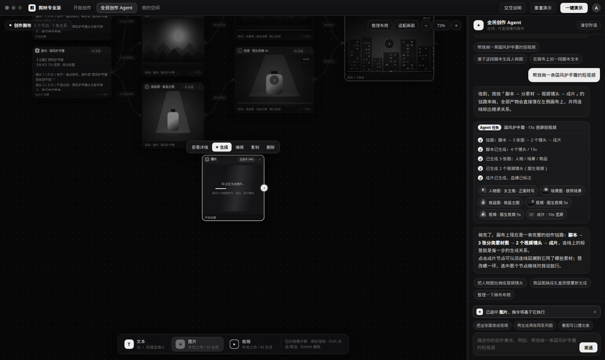

# 全民创作 Agent · 无限画布 MVP Demo（剪映 PC 端）

一个**可操作**的桌面端交互原型：左侧无限画布 + 右侧全民创作 Agent 对话面板，用来验证「对话下指令 → 画布长出成品 → 连线表达生成血缘」这条主线。

设计结论与 MVP 取舍见 [`DESIGN.md`](./DESIGN.md)。

一句话生成的完整链路（脚本 → 3 张分类素材图 → 2 个视频镜头 → 成片），连线标签就是生成关系：



选中任一节点，只高亮它的血缘链（下图选中「商品图」，脚本→商品图→图生视频→成片亮起，其余淡出）：



点卡片右上角 ⤢ 打开「查看详情」——本质是把画布这一块放大，上下游仍连在画面边缘：



节点内的两种素材来源：本地上传 / AI 生成（提示词 → 进度 → 出图）：

| AI 生成入口 | 生成中占位 |
| --- | --- |
|  |  |

## 运行

纯静态、零依赖、完全离线，两种方式都行：

```bash
# 方式一：直接打开
open demo/capcut-creative-agent/index.html      # macOS
# Windows 双击 index.html 即可

# 方式二：起个本地服务（推荐，行为与线上一致）
cd demo/capcut-creative-agent && python3 -m http.server 4321
# 浏览器访问 http://localhost:4321/index.html
```

建议窗口宽度 ≥ 1440px（模拟 PC 客户端布局）。

## 3 分钟演示路径

1. 点右上角 **一键演示** —— Agent 会把「脚本 → 人物图/场景图/商品图 → 2 个视频镜头 → 成片」整条链路画在画布上，任务卡里的产出节点可点击定位。
2. 点画布上任意节点，观察**血缘高亮**（祖先+后代亮起，其余淡出）；点卡片底部「来自：…」飞到父节点；成片节点点「来自 N 个素材」会把用到的素材一起框进视野。
3. 底部 Dock **文本** → 光标已在卡内，直接键盘输入；**图片 / 视频** → 卡内选择「上传本地素材」或「AI 生成」（AI 生成会走提示词 → 进度 → 出图/出片）。
4. 选中一张图 → 卡片右侧 **⊕** → **图生视频**，看连线标签变成「图生视频」。
5. 点任意卡片右上角的 **⤢**（或直接双击卡片）打开**局部放大预览**：这不是另一个页面，就是把这块画布放大——当前节点被放到 150% 以上，上下游故意露在画面边缘，连线标签照旧。右侧详情栏有提示词、素材尺寸、血缘路径和「以它为素材继续生成」；点上下游卡片可以继续深入，`←` `→` 翻同批产物，`Esc` 返回。
6. `Shift` 点选 2 个以上素材 → 悬浮条 **✦ 批量生成** → **合成为一条成片**，观察多对一血缘。
7. 对话里试试：`基于这段脚本生成人物图`、`把这张图变成视频`、`拆成 3 条分镜`、`把选中的素材合成一条成片`、`整理一下画布布局`。
8. 右上角 **交互说明** 里是完整的手势 / 快捷键清单。

## 目录结构

```
demo/capcut-creative-agent/
├── index.html            客户端外壳 + 画布/对话骨架
├── DESIGN.md             MVP 交互设计与取舍（主要交付物）
├── styles/
│   ├── base.css          外壳、弹层、Toast
│   ├── canvas.css        画布、节点卡片、连线、浮层工具
│   ├── preview.css       局部放大预览页
│   └── chat.css          对话面板、任务卡、上下文胶囊
└── scripts/
    ├── util.js           工具函数（补间动画、种子随机、Toast）
    ├── media.js          程序化生成"AI 素材"占位图（离线、可复现）
    ├── store.js          数据模型：节点 / 血缘 / 选区 / 视口 / 撤销栈
    ├── canvas.js         视口手势、节点渲染、连线绘制、节点内交互
    ├── preview.js        局部放大预览页（复用画布卡片与连线）
    ├── generate.js       派生动作表 + 生成过程模拟 + 自动布局落点
    ├── chat.js           对话 UI：消息流、任务卡、产出节点回链
    ├── agent.js          意图路由：自然语言 → 画布原子操作
    └── app.js            装配：Dock、上传、分栏拖拽、演示引导
```

## Demo 的模拟边界

这是交互原型，不接任何模型服务，以下部分是**模拟**的：

- **AI 生成的图片 / 视频封面**：`media.js` 用 Canvas 2D 按提示词哈希程序化绘制（人物 / 场景 / 商品 / 抽象四种风格），同一提示词稳定产出同一张图，完全离线。
- **生成耗时与进度**：图片 1.5~2.4s、视频 2.4~3.6s 的模拟进度条；同批任务错峰 260ms 启动。
- **AI 视频播放**：用封面图 + Ken Burns 位移 + 时间轴进度模拟；**本地上传的视频是真实播放**的 `<video>`。
- **Agent 意图理解**：`agent.js` 里是关键词路由，不是真的 LLM；覆盖了脚本 / 分镜 / 人物图 / 场景图 / 商品图 / 文生视频 / 图生视频 / 合成成片 / 整理布局 / 新增节点这些意图，其余走能力介绍兜底。

真实实现时需要替换的只有三处：`generate.js` 的生成调用、`media.js` 的素材来源、`agent.js` 的意图理解（换成模型 + 工具调用），画布与血缘逻辑可以原样保留。
